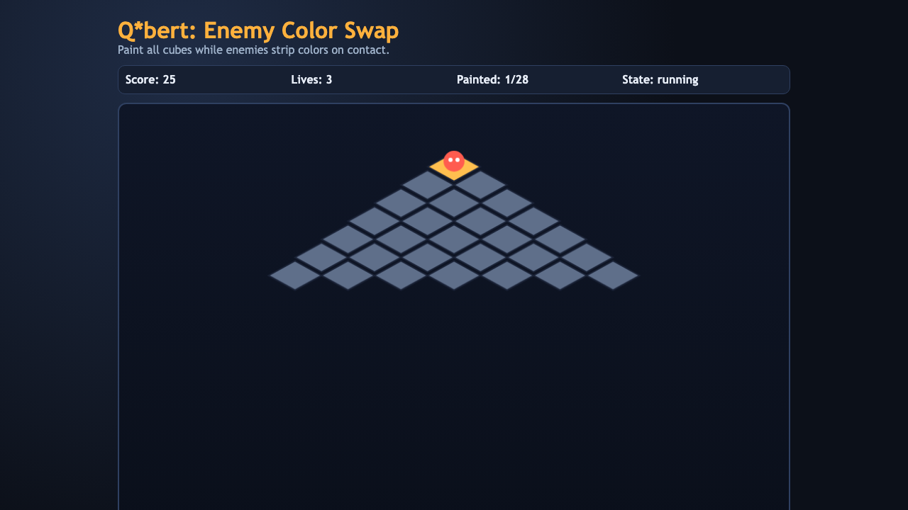

# daily-classic-game-2026-04-13-qbert-enemy-color-swap

<div align="center">
  <h3>Deterministic Q*bert remake where enemy patrols actively strip painted tiles.</h3>
  <p>Classic hop-and-paint routing with fixed-step simulation and automation hooks.</p>
</div>

<div align="center">
  
</div>

## GIF Captures
- Opening Route: `artifacts/playwright/clip-01-opening.gif`
- Enemy Pressure: `artifacts/playwright/clip-02-enemy-pressure.gif`
- Recovery Route: `artifacts/playwright/clip-03-recovery-route.gif`

## Quick Start
```bash
pnpm install
pnpm dev
```

## How To Play
- Hop diagonally across pyramid tiles using arrow keys.
- Paint every tile at least once to complete the round.
- Avoid enemy collisions and avoid falling off the board.

## Rules
- The board has 28 tiles (7 rows).
- Valid movement is diagonal only (`Up`, `Right`, `Down`, `Left` mapping to Q*bert-style hops).
- Walking off-board removes one life and respawns at top.
- Enemy movement is deterministic and periodically unpaints tiles they touch.
- Round ends on full paint (win) or when lives reach zero (game over).

## Scoring
- +25 for each newly painted tile.
- +500 completion bonus for painting all tiles.

## Twist
- **Enemies swap colors**: enemy patrols remove painted state from tiles they traverse, forcing repaint and route adjustment.

## Verification
```bash
pnpm test
pnpm build
pnpm capture
```

## Project Layout
- `src/` browser game and deterministic simulation core
- `tests/` node test coverage for core rules
- `scripts/` build, self-check, and Playwright capture
- `artifacts/playwright/` screenshots and GIF clips
- `docs/plans/` implementation and automation capture plans
- `assets/` static media files
